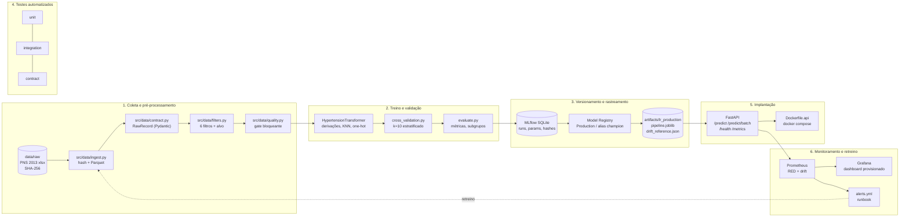
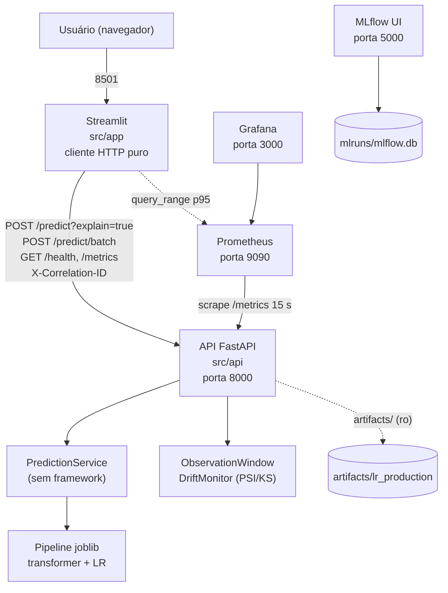

# Arquitetura

Produtização do modelo de risco de hipertensão (Dias, 2024) em seis etapas de
pipeline. Toda a execução é local (máquina Windows, Docker Compose) ou em runners
efêmeros do GitHub Actions; não há serviço de nuvem.

## 1. Pipeline de seis etapas



## 2. Componentes em execução (docker compose)



## 3. Camadas e dependências (Clean Architecture)

| Camada | Módulos | Depende de | Não depende de |
|---|---|---|---|
| Domínio | `src/features/derivations.py`, `src/models/evaluate.py`, `src/monitoring/drift.py` | pandas, numpy, config tipada | framework web, MLflow, Streamlit |
| Aplicação | `src/features/transformer.py`, `src/models/train.py`, `src/api/service.py`, `src/monitoring/window.py`, `src/monitoring/scenarios.py` | domínio, scikit-learn | FastAPI, Streamlit |
| Infraestrutura | `src/data/ingest.py`, `src/models/registry.py` (MLflow/JSON), `src/api/main.py`, `src/api/metrics.py`, `src/app/main.py` | aplicação | |
| Configuração | `src/config.py`, `configs/config.yaml`, `configs/variable_mapping.yaml` | pydantic-settings | |

Regra aplicada: a lógica de predição (`PredictionService`) e as estatísticas de drift
são testadas sem FastAPI, sem Prometheus e sem Streamlit; os frameworks só aparecem na
borda (`main.py`, `metrics.py`, `app/main.py`). O `ExperimentTracker` é um `Protocol`
com duas implementações (MLflow e JSON), o que mantém o treino independente do serviço
de tracking.

## 4. Fluxo de uma requisição `/predict`

```mermaid
sequenceDiagram
    participant C as Streamlit / cliente
    participant M as Middleware
    participant P as PredictionService
    participant T as Transformer
    participant W as DriftMonitor
    C->>M: POST /predict?explain=true (X-Correlation-ID)
    M->>M: valida payload (Pydantic, 61 variáveis)
    M->>P: predict_records([record])
    P->>T: transform_detailed (derivações, KNN se exame ausente, one-hot)
    T-->>P: matriz 1x85 + campos imputados
    P->>P: predict_proba, faixa de risco, contribuições coef*x
    P-->>M: Prediction
    M->>W: observe(record) (janela de drift)
    M-->>C: 200 JSON (probabilidade, faixa, versão, imputed_fields, contribuições, disclaimer)
    Note over M: log JSON com correlation_id, status, duração; histograma e contadores Prometheus
```

## 5. CI/CD (GitHub Actions)

| Job | Gate |
|---|---|
| quality | ruff, black, mypy strict, bandit, pip-audit (locks da API e da interface) |
| tests | fixture sintética, gate de qualidade de dados (fixture e extrato real), pytest com cobertura mínima de 80 %, cenários de drift offline |
| train | dez runs no MLflow, regressão contra `golden_metrics.json`, upload do store e das evidências |
| docker | build das três imagens (API, interface e treino), smoke tests: usuário não root e ausência de bibliotecas de treino nas imagens de serviço; na imagem de treino, gate de qualidade e testes unitários executados dentro do container |
| stack | compose com API, interface, Prometheus e Grafana; cenários de drift via API (gate); teste de carga (informativo); verificação de alvo do Prometheus e dashboard do Grafana |
| release (`cd.yml`) | em tag `v*`: build das imagens, release no GitHub com o zip de evidências |
